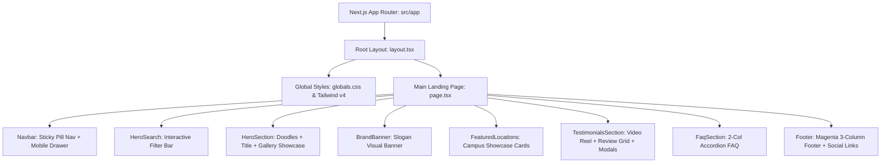

# Studio i — Project Brain & Knowledge Architecture (`brain.md`)

> **Single Source of Truth (SSOT)** for the **Studio i Coworking Spaces & Community Platform** web application.  
> *Last Updated: March 2026*

---

## 1. Executive Summary & Brand Identity

### 1.1 Overview
**Studio i** is a premium, modern coworking space and shared workspace ecosystem operating in Rajasthan (Jaipur & Alwar), India. The web application serves as the digital front door, showcase, and discovery/booking portal for freelancers, creative professionals, startups, and enterprise teams seeking flexible workspaces.

### 1.2 Core Brand Pillars & Slogans
- **Headline**: *"A Workspace for Every You"*
- **Tagline**: *"Your Space. Your Work. Your Way."*
- **Value Proposition**: Flexible desks, private cabins, meeting rooms, and event spaces — book inspiring coworking spaces instantly, anytime, anywhere.
- **Design Philosophy**: High visual contrast, vibrant brand magenta accents, clean whitespace, sleek rounded typography, mobile-first responsiveness, and human-centric micro-interactions.

### 1.3 Brand Palette & Visual Tokens
| Token | Hex Value | Role / Usage |
| :--- | :--- | :--- |
| **Brand Magenta (Primary)** | `#FF007A` | Primary accent, CTAs, highlight text, selection background, active states |
| **Brand Magenta Hover** | `#E0006C` | Hover / active button states |
| **Brand Pure Black** | `#000000` | Floating pill navbar, dark cards, footer contrast elements |
| **Brand Deep Neutral** | `#0A0A0A` / `#171717` | Text primary (`text-neutral-950`), card backgrounds |
| **Neutral Border / Muted** | `#E5E7EB` / `#D4D4D4` | Card borders, section dividers, dropdown outlines |
| **Clean White** | `#FFFFFF` | Page canvas, card backgrounds, inverted text |
| **Accent Gold** | `#FBBF24` (`amber-400`) | Campus review star ratings |

### 1.4 Typography
- **Primary Font Family**: `Plus Jakarta Sans` (`next/font/google`)
- **Weights Loaded**: `300` (Light), `400` (Regular), `500` (Medium), `600` (SemiBold), `700` (Bold), `800` (ExtraBold)
- **Fallback Font Stack**: `-apple-system, BlinkMacSystemFont, "Segoe UI", Roboto, sans-serif`

---

## 2. Technology Stack & Architecture

### 2.1 Core Framework & Libraries
- **Runtime & Framework**: [Next.js](https://nextjs.org/) `16.3.5` (App Router architecture with React Server & Client Components)
- **UI Runtime**: [React](https://react.dev/) `19.2.8` & [React DOM](https://react.dev/) `19.2.8`
- **Language**: [TypeScript](https://www.typescriptlang.org/) `^5.0.0` with strict type checking enabled (`tsconfig.json`)
- **Styling**: [Tailwind CSS](https://tailwindcss.com/) `^4.0.0` via `@tailwindcss/postcss` with zero-config CSS imports (`@import "tailwindcss";`)
- **Motion & Interactions**: [Framer Motion](https://www.framer.com/motion/) `^13.4.0` (installed for advanced transitions)
- **Iconography**: [Lucide React](https://lucide.dev/) `^1.47.0` + Custom vector SVGs for brand-accurate social icons
- **Code Quality**: [ESLint](https://eslint.org/) `^9.0.0` with `eslint-config-next`

### 2.2 System Architecture Diagram


---

## 3. Directory & File Structure

```
studioiwebsite/
├── .next/                         # Next.js compiled build output & cache
├── public/                        # Static assets served at root
│   ├── assets/                    # Primary production media & graphics
│   │   ├── avatar-rahul.jpg       # Testimonial member avatar (CEO of TPL)
│   │   ├── banner-strip-clean.png # "Your Space. Your Work. Your Way." graphic strip
│   │   ├── building-horizon.png   # Horizon Tower campus photograph
│   │   ├── building-lehariya.png  # Lehariya KGK Realty campus photograph
│   │   ├── doodle-left-complete.png  # "Some Space New Possibilities" sticker
│   │   ├── doodle-right-complete.png # "Work & Connect" sticker
│   │   ├── hero-gallery-strip-clean.png # Central mobile phone mockup + space categories
│   │   ├── logo-studioi.png       # Official Studio i black/magenta brand logo
│   │   ├── testimonial-reel-card.png # Native portrait reel card mockup
│   │   ├── slider/                # Workspace category column slices & assets
│   │   └── workspaces/            # Dedicated category imagery (Hot desk, private cabin, etc.)
│   ├── favicon.ico                # Studio i site favicon
│   ├── globe.svg / next.svg / ... # Standard SVG fallbacks
├── src/
│   ├── app/
│   │   ├── globals.css            # Tailwind v4 import, CSS variables, scrollbars, keyframes
│   │   ├── layout.tsx             # Root layout, Plus Jakarta Sans font loader, SEO metadata
│   │   └── page.tsx               # Primary landing page assembling all components
│   └── components/
│       ├── BrandBanner.tsx        # Slogan banner strip component
│       ├── FaqSection.tsx         # Interactive accordion FAQ with instant toggle state
│       ├── FeaturedLocations.tsx  # Campus highlight cards (Lehariya & Horizon Tower)
│       ├── Footer.tsx             # Brand magenta footer with links, contact, & copyright
│       ├── HeroSearch.tsx         # Multi-parameter quick filter bar with dropdowns & date picker
│       ├── HeroSection.tsx        # Hero headline, floating doodles, gallery strip, and CTA
│       ├── Navbar.tsx             # Sticky dark pill navigation with mobile menu drawer
│       ├── SocialIcons.tsx        # Optimized SVGs for Instagram, Facebook, LinkedIn, X
│       └── TestimonialsSection.tsx # Video story reel card, testimonial cards, & 2 modal dialogs
├── AGENTS.md                      # Agent rules & Next.js compatibility instructions
├── CLAUDE.md                      # Claude CLI instructions
├── eslint.config.mjs              # ESLint configuration
├── next.config.ts                 # Next.js compiler & runtime configurations
├── package.json                   # Dependencies, engines, and npm scripts
├── postcss.config.mjs             # PostCSS Tailwind plugin configuration
├── README.md                      # Standard Next.js readme
└── tsconfig.json                  # TypeScript compiler settings & path aliases (@/*)
```

---

## 4. Comprehensive Component Breakdown

### 4.1 `Navbar.tsx` (`src/components/Navbar.tsx`)
- **Type**: Client Component (`"use client"`)
- **Role**: Top-level persistent navigation bar.
- **Visual Design**: Sleek floating rounded pill (`rounded-full`) styled in pure black with subtle dark borders (`border-neutral-800`), glass backdrop blur (`backdrop-blur-md`), and elevated drop shadow.
- **Features**:
  - Studio i official logo with Next.js image optimization (`priority`).
  - Desktop nav links: `Home`, `Service`, `Experience`, `Horizon Tower, Jaipur` with animated magenta hover underline transitions (`group-hover:w-full`).
  - Mobile hamburger toggle icon (`Menu` / `X` from `lucide-react`).
  - Animated mobile drawer with quick navigation links and a "Book a Tour" magenta CTA button.

### 4.2 `HeroSearch.tsx` (`src/components/HeroSearch.tsx`)
- **Type**: Client Component (`"use client"`)
- **Role**: Airbnb-style quick booking/search filter bar that anchors user intent right below the navbar.
- **Key States**:
  - `selectedLocation`: Defaults to *"Search Co-Working Space"*; selectable campuses:
    1. *Horizon Tower, Jaipur*
    2. *Lehariya | KGK Realty, Jaipur*
    3. *Rathore Bhawan, Alwar*
  - `selectedDate`: Defaults to *"Add the date when you booked."*; includes HTML5 date picker plus quick preset chips (*Today*, *Tomorrow*, *Next Monday*).
  - `selectedSpace`: Defaults to *"Choose your workspace"*; selectable spaces:
    1. *Hot Desk*
    2. *Dedicated Desk*
    3. *Private Cabin*
    4. *Meeting Room*
    5. *Event Space*
    6. *Community Pass*
  - `activeDropdown`: Controls toggle visibility (`location` | `when` | `space`).
- **Interactive Search Action**: Magenta circular trigger button with magnifying glass icon executing the consolidated search intent.

### 4.3 `HeroSection.tsx` (`src/components/HeroSection.tsx`)
- **Type**: Client Component (`"use client"`)
- **Role**: Primary above-the-fold engagement section.
- **Visual Elements**:
  - **Left Animated Doodle Sticker**: Custom badge reading *"Some Space New Possibilities"* with directional arrow, floating subtly via `@keyframes floatSlow`.
  - **Right Animated Doodle Sticker**: Custom badge reading *"Work & Connect"* with directional arrow, floating with a staggered 1.5s delay.
  - **Hero Typography**: Bold 58px high-impact heading *"A Workspace for Every You"* with magenta accent.
  - **Visual Showcase Gallery Strip**: Central image (`hero-gallery-strip-clean.png`) integrating the mobile app mockup alongside various workspaces, smoothly fading to pure white at the base.
  - **Primary CTA**: *"Find Your Perfect Workspace"* rounded dark pill button anchored over the gallery base with micro-scaling interactions.

### 4.4 `BrandBanner.tsx` (`src/components/BrandBanner.tsx`)
- **Type**: Client Component (`"use client"`)
- **Role**: Graphical slogan separator.
- **Content**: Renders `banner-strip-clean.png` featuring the core Studio i slogan: *"Your Space. Your Work. Your Way."*

### 4.5 `FeaturedLocations.tsx` (`src/components/FeaturedLocations.tsx`)
- **Type**: Client Component (`"use client"`)
- **Role**: Highlights the prime flagship campuses in Jaipur.
- **Campuses Showcased**:
  1. **A Tower - 1st Floor, Lehariya | KGK Realty**
     - Subtitle: *Near Jawahar Circle, Malviya Nagar, Jaipur*
     - Badge: *Flagship Campus*
     - Rating: `4.5/5` with gold star icon
     - Photography: `building-lehariya.png` with zoom-on-hover effect
  2. **1007-08, 10th Floor, Horizon Tower**
     - Subtitle: *JLN Marg, Tonk Road, Jaipur*
     - Badge: *Premium Executive*
     - Rating: `4.3/5` with gold star icon
     - Photography: `building-horizon.png` with zoom-on-hover effect

### 4.6 `TestimonialsSection.tsx` (`src/components/TestimonialsSection.tsx`)
- **Type**: Client Component (`"use client"`)
- **Role**: Builds social proof through member feedback and video reels.
- **Layout**: 3-Column Responsive Grid (12-column layout on `lg` screens):
  - **Left Column (4 cols)**: 2 white testimonial cards with quotes, member name, role (*Rahul Singh, CEO of TPL*), and rounded avatar badges.
  - **Center Column (4 cols)**: Portrait video story card (`testimonial-reel-card.png`) mirroring the original design PDF with:
    - Interactive **Play Video** hotspot launching the *Member Video Story Modal*.
    - Interactive **Follow on Social Media** hotspot launching the *Community Channels Modal*.
  - **Right Column (4 cols)**: 2 additional testimonial cards matching the left column for symmetrical balance.
- **Modals Included**:
  1. *Video Reel Preview Modal*: Shows play animation, summary of 500+ founder testimonials, and dismiss control.
  2. *Social Media Modal*: Provides direct links to Studio i's Instagram (`@studioi_cowork`), LinkedIn (`Studio i Workspaces`), Facebook (`Studio i Community`), and X (`@studioi_hq`).

### 4.7 `FaqSection.tsx` (`src/components/FaqSection.tsx`)
- **Type**: Client Component (`"use client"`)
- **Role**: Answers high-frequency prospect questions with an expandable accordion.
- **Architecture**: 2-Column split view:
  - **Left**: Sticky column with heading *"Your Questions Answered"*, descriptive copy, and *"Contact our team"* action link.
  - **Right**: Clean border-divided accordion with smooth expand/collapse toggles, magenta state highlights, and rotation icons.
- **Covered Topics**:
  1. Workspace options (Hot desks, dedicated desks, private cabins, event rooms).
  2. Flexible booking policies and monthly/annual terms.
  3. Meeting room hourly reservations, 4K casting, and WiFi.
  4. Day passes (8 AM - 11 PM access + specialty coffee).
  5. Instant onboarding via digital keycards & workspace credits.
  6. Member community networking events and 24/7 WhatsApp concierge.

### 4.8 `Footer.tsx` (`src/components/Footer.tsx`)
- **Type**: Client Component (`"use client"`)
- **Role**: Brand anchor and legal/navigation wrap-up.
- **Styling**: Solid full-bleed Studio i Brand Magenta (`bg-[#FF007A]`) with crisp white typography.
- **Sections**:
  1. **Brand & Mission**: Studio i logo with unique dot-i geometry, brand narrative ("We don't just offer services—we create growth engines..."), and social icon buttons.
  2. **Quick Links**: About Us, Service, Co-Working Space, Business Profile, Privacy Policy, Terms & Conditions, Contact Us.
  3. **Location & Operating Hours**: Full address (*1 Rathore Bhawan Near Jaipaltaln, Alwar, Rajasthan, 301001, India*) and operating hours (*Available Daily: 8am - 11pm*).
  4. **Copyright Bar**: *"© 2026 Shyam Media Group All rights reserved"* and social icon row.

### 4.9 `SocialIcons.tsx` (`src/components/SocialIcons.tsx`)
- Lightweight, crisp SVG components with configurable dimensions and fill:
  - `InstagramIcon`
  - `FacebookIcon`
  - `LinkedinIcon`
  - `XTwitterIcon` (modern X logo geometry)

---

## 5. Design Assets & Image Catalog

All images reside under `public/assets/`:

| File Name | Dimensions / Size | Purpose |
| :--- | :--- | :--- |
| `logo-studioi.png` | 25 KB | Official black & magenta header logo |
| `doodle-left-complete.png` | 23 KB | "Some Space New Possibilities" sticker badge |
| `doodle-right-complete.png` | 10 KB | "Work & Connect" sticker badge |
| `hero-gallery-strip-clean.png` | 2955 x 930 (3.2 MB) | Hero center showcase with mobile phone mockup and spaces |
| `banner-strip-clean.png` | 2718 x 171 (710 KB) | "Your Space. Your Work. Your Way." banner strip |
| `building-lehariya.png` | 1.8 MB | Lehariya KGK Realty campus photo |
| `building-horizon.png` | 1.2 MB | Horizon Tower campus photo |
| `testimonial-reel-card.png` | 750 x 1260 (931 KB) | Portrait reel card mockup with Rahul Singh video frame |
| `avatar-rahul.jpg` | 617 KB | Circular avatar image of Rahul Singh (CEO of TPL) |
| `slider/` & `workspaces/` | Multi-image subdirectories | Individual category crops (dedicated desk, private cabin, meeting room) |
| `HERO SECTION.pdf` | 19.5 MB | Original design blueprint / reference Canva artwork |

---

## 6. Environment, Scripts & Run Guide

### 6.1 Available NPM Scripts
In `package.json`:
```json
{
  "scripts": {
    "dev": "next dev",
    "build": "next build",
    "start": "next start",
    "lint": "eslint"
  }
}
```

### 6.2 Common Issue & Resolution: `'next' is not recognized`
If running `npm run dev` in PowerShell/CMD yields:
```
'next' is not recognized as an internal or external command
```
**Root Cause**:
`node_modules` dependencies were either partially installed, npm cache was corrupted, or `.bin` symlinks are missing.

**Resolution Steps**:
1. Run a clean install:
   ```bash
   npm install
   ```
2. If issues persist, force-reinstall or run via npx:
   ```bash
   npx next dev
   ```
3. Verify Node.js version is `>= 18.17.0` (Node 20+ recommended).

---

## 7. Configuration Details

### 7.1 `next.config.ts`
```typescript
import type { NextConfig } from "next";

const nextConfig: NextConfig = {
  /* config options here */
};

export default nextConfig;
```

### 7.2 `src/app/globals.css`
- Uses Tailwind CSS v4 directive: `@import "tailwindcss";`
- Root color variables:
  ```css
  :root {
    --brand-pink: #FF007A;
    --brand-pink-hover: #E0006C;
    --brand-dark: #000000;
  }
  ```
- Custom floating animation:
  ```css
  @keyframes floatSlow {
    0%, 100% { transform: translateY(0); }
    50% { transform: translateY(-6px); }
  }
  .animate-float {
    animation: floatSlow 4s ease-in-out infinite;
  }
  ```
- Branded scrollbar with magenta hover state (`::-webkit-scrollbar-thumb:hover { background: #FF007A; }`).

---

## 8. Roadmap & Next Evolutions

1. **Dynamic Booking Engine**: Connect `HeroSearch` dropdown values to an interactive schedule and checkout flow (e.g. Stripe / Razorpay integration for Day Passes and Meeting Rooms).
2. **Individual Campus Detail Pages**: Create dynamic routes (`/locations/lehariya` and `/locations/horizon-tower`) with interactive floor plans, 360-degree virtual tours, and live desk availability.
3. **Member Community Portal**: Add user authentication (NextAuth / Supabase) allowing members to manage their access cards, reserve conference rooms with credits, and RSVP to weekly networking events.
4. **Interactive Video Player**: Replace the video modal thumbnail in `TestimonialsSection` with an embedded HTML5 / Vimeo / YouTube player for seamless member story playback.
5. **SEO & Structured Data**: Implement `LocalBusiness` / `CoWorkingSpace` JSON-LD schema markup to boost local search rankings across Jaipur and Alwar.
