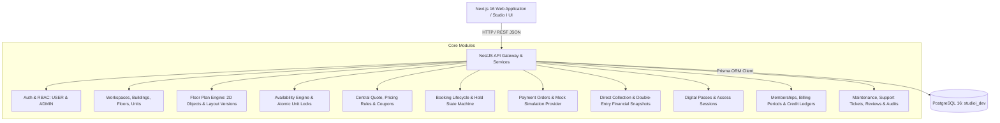

# Studio I — Architecture & Relational Data Model (`ARCHITECTURE_AND_DATA_MODEL.md`)

> **Database & Architecture Specification**  
> Engine: PostgreSQL 16  
> ORM: Prisma ORM v6  
> Minor Unit Financial Precision: Integer paise (`1 INR = 100 paise`)  
> Timezone Strategy: Instants stored in UTC (`TIMESTAMPTZ`), workspace operating schedules computed using IANA timezone (`Asia/Kolkata`).

---

## 1. System Architecture Overview



---

## 2. Relational Schema Design

### 2.1 Core Enums
```prisma
enum Role {
  USER
  ADMIN
}

enum UnitType {
  HOT_DESK
  DEDICATED_DESK
  PRIVATE_CABIN
  MEETING_ROOM
  CONFERENCE_ROOM
  EVENT_SPACE
}

enum UnitStatus {
  ACTIVE
  MAINTENANCE
  DISABLED
  ARCHIVED
}

enum PlanType {
  HOURLY
  DAILY
  WEEKLY
  MONTHLY
}

enum BookingStatus {
  PENDING_PAYMENT
  CONFIRMED
  ACTIVE
  COMPLETED
  CANCELLED
  NO_SHOW
}

enum HoldStatus {
  ACTIVE
  CONVERTED
  EXPIRED
  RELEASED
}

enum PaymentStatus {
  PENDING
  SUCCESS
  FAILED
  REFUNDED
  PARTIALLY_REFUNDED
}

enum RefundStatus {
  NONE
  PENDING
  COMPLETED
  FAILED
}

enum PassStatus {
  ACTIVE
  REVOKED
  EXPIRED
}

enum IssueStatus {
  OPEN
  IN_PROGRESS
  RESOLVED
  CLOSED
}

enum IssuePriority {
  LOW
  MEDIUM
  HIGH
  URGENT
}
```

### 2.2 Entity Relationship Overview (Key Models)

1. **`User` & `AdminScope`**:
   - `id`: UUID PK
   - `email`: String unique
   - `passwordHash`: String
   - `role`: `Role` (Default: `USER`)
   - `name`, `phone`, `companyName`, `gstin`: Profile fields
   - `isBlocked`: Boolean (default: false)
   - `adminScope`: Relation to location-scoped admin permissions

2. **Hierarchical Coworking Inventory**:
   - **`Workspace`**: Campus (e.g. Horizon Tower, Lehariya). Contains address, city, lat, lng, timezone, amenities, opening hours, photos.
   - **`Building`**: Building block inside campus.
   - **`Floor`**: Specific level. Contains floor plan versions.
   - **`Zone`**: Area within floor (e.g. Silent Zone, Executive Wing, Cafe Area).
   - **`Unit`**: The atomic bookable element (e.g., Desk #12, Cabin #4A, Boardroom #1).
     - Fields: `unitCode`, `unitType`, `capacity`, `status`, `x`, `y`, `width`, `height`, `rotation`.
     - Parent/Child: `parentUnitId` for whole-cabin vs individual desk conflict protection.

3. **Floor Plan Management**:
   - **`FloorPlanVersion`**: Versioned layout (Draft, Published).
   - **`FloorPlanObject`**: Canvas objects (Bookable units, walls, doors, reception, pantry, restrooms).

4. **Pricing, Plans & Availability**:
   - **`BookingPlan`**: Sellable products for a unit type (e.g. "Dedicated Desk Monthly", "Hot Desk Day Pass", "Meeting Room Hourly").
   - **`PricingRule`**: Base rate in paise, peak hour multipliers, weekend rates.
   - **`OpeningHours`**: Day-of-week opening/closing times and holiday exceptions.
   - **`AvailabilityBlock`**: Operational blocks for maintenance, VIP events, or closures.

5. **Booking, Holds & Reservations**:
   - **`Booking`**: Top-level booking record with code, user, schedule interval `[startDateTime, endDateTime]`, plan, amounts, status.
   - **`BookingItem`**: The specific Unit reserved for the interval.
   - **`InventoryHold`**: Short-term lock (10 minutes) reserving the unit during checkout. Contains user, unit, expiration time, hold status.
   - **`BookingChange`**: Audit record for reschedules and extensions.

6. **Financial Snapshots & Payments**:
   - **`PaymentOrder`**: Gateway order reference (Razorpay / Cashfree MOCK), amount, currency, status.
   - **`BookingFinanceSnapshot`**: Immutable double-entry financial record capturing gross amount, coupon discount, tax paise, security deposit paise, payment provider fee, and net collected revenue.
   - **`Refund`**: Itemized refund record with provider refund ID, amounts, and source allocation.

7. **Memberships & Wallets**:
   - **`MembershipPlan`**: Flexi Pass, Dedicated Resident, Virtual Office.
   - **`Membership`**: User's active contract, billing period, start/end dates.
   - **`CreditLedger`**: Meeting room credits balance, grants, and consumption history.

8. **Digital Pass & Operations**:
   - **`DigitalPass`**: Signed QR token string, validity window, access privileges.
   - **`AccessSession`**: Check-in / check-out timestamped logs.
   - **`MaintenanceIssue`**: Category, photo URL, priority, assigned admin, resolution notes.
   - **`SupportTicket`**: Message thread between user and admin.
   - **`AuditLog`**: System actions, permission changes, financial overrides.

---

## 3. Concurrency & Double-Booking Invariant

### 3.1 Interval Invariant
Given an existing reservation with interval `[E_start, E_end)` and a requested interval `[R_start, R_end)`:
$$\text{Conflict} \iff (E_{start} < R_{end}) \land (E_{end} > R_{start})$$

### 3.2 Database-Enforced Lock Mechanism
To guarantee zero double-booking even across separate Node processes:
1. Every reservation or hold begins a PostgreSQL transaction.
2. The transaction acquires an exclusive row lock on the target `Unit` row:
   ```sql
   SELECT id FROM "Unit" WHERE id = $1 FOR UPDATE;
   ```
3. Inside the locked context, the database checks:
   - Unit is `ACTIVE`
   - Unit is not within an active `AvailabilityBlock`
   - Unit has NO overlapping `BookingItem` where `Booking.status IN ('CONFIRMED', 'ACTIVE')`
   - Unit has NO overlapping `InventoryHold` where `status = 'ACTIVE' AND expiresAt > NOW()`
4. If child/parent units exist (e.g. cabin and its desks), the lock orders IDs deterministically (`ORDER BY id ASC`) and checks parent/child conflict in both directions.
5. If clean, create the `InventoryHold` or `BookingItem` and commit.
